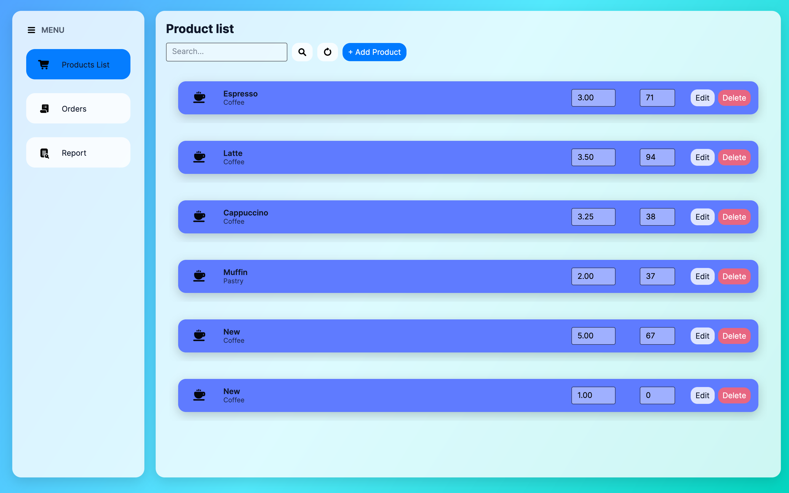
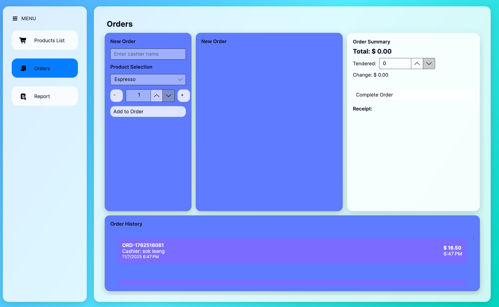

# ☕ Coffee Shop POS Application

[](https://dotnet.microsoft.com/)
[](https://avaloniaui.net/)
[](https://www.microsoft.com/sql-server)
[](https://www.docker.com/)
[](LICENSE)

A modern, full-featured Point-of-Sale (POS) system for coffee shops built with **Avalonia UI** and **.NET 9**. Features a beautiful liquid glass UI design, complete order management, inventory tracking, and sales reporting.

*ប្រព័ន្ធគ្រប់គ្រងហាងកាហ្វេទំនើប ដែលបង្កើតឡើងដោយប្រើ Avalonia UI និង .NET 9 ជាមួយនឹង UI ស្អាតនិងមាន features ពេញលេញ។*

---

## 📸 Screenshots

### Main Interface - Product Management

*Product management with search, add, edit, delete functionality*

### Order Processing

*Create orders, calculate totals, process payments with real-time stock updates*

### Sales Reports

*Daily sales summary with Cambodia timezone support*

---

## ✨ Features

### 🛍️ Product Management
- ✅ Add, edit, delete products
- ✅ Category organization (Coffee, Tea, etc.)
- ✅ Real-time stock tracking
- ✅ Price management
- ✅ Search and filter products
- ✅ Product icons with visual indicators

### 🧾 Order Processing
- ✅ Create new orders with multiple items
- ✅ Quantity increment/decrement controls
- ✅ Automatic total calculation
- ✅ Tendered amount and change calculation
- ✅ Order completion with transaction support
- ✅ Recent orders history with per-order totals
- ✅ Stock deduction on order completion
- ✅ Order receipt generation

### 📊 Sales Reporting
- ✅ Daily sales summary
- ✅ Revenue and order count tracking
- ✅ Date range filtering
- ✅ **Cambodia timezone support** (Asia/Phnom_Penh, UTC+7)
- ✅ Total revenue and order calculations
- ✅ Visual sales data presentation

### 🎨 UI/UX
- ✅ **Liquid glass design** with gradient backgrounds
- ✅ Modern, responsive layout
- ✅ Icon-based navigation
- ✅ Color-coded menu selection (#615FFF)
- ✅ Smooth hover and click effects
- ✅ macOS-inspired visual style

---

## 🏗️ Architecture & Design

This project demonstrates **Object-Oriented Programming (OOP)** principles and modern software architecture patterns.

### OOP Principles Applied

#### 1. Inheritance
```csharp
ViewModelBase (abstract base class)
    ↓
    ├── MainViewModel
    ├── ProductListViewModel
    ├── OrderViewModel
    └── ReportViewModel
```
All ViewModels inherit from `ViewModelBase` (which extends `ObservableObject`), providing automatic property change notification.

#### 2. Polymorphism
```csharp
IRepository<T> (interface)
    ↓
    ├── SqlProductRepository : IRepository<Product>
    ├── SqlOrderRepository : IRepository<Order>
    └── SqlOrderItemRepository : IRepository<OrderItem>
```
Same interface contract, different implementations for each entity type.

#### 3. Encapsulation
- **Private fields** (`_products`, `_service`, `_db`) hide implementation details
- **Public properties** expose controlled access
- **Computed properties** (`Total`, `Change`) encapsulate business logic
- **Auto-properties** with getter/setter control

#### 4. Abstraction
```csharp
IRefreshable (interface)
    ↓
    ├── ProductListViewModel
    └── ReportViewModel
```
Defines refresh behavior without exposing implementation details.

### 📐 UML Diagrams

Complete UML class diagrams are available in the `Docs/` folder:

- **[OOP_Principles_UML.svg](Docs/OOP_Principles_UML.svg)** / **[PNG](Docs/OOP_Principles_UML.png)** - Demonstrates OOP principles
- **[CoffeeShopApp_UML.svg](Docs/CoffeeShopApp_UML.svg)** / **[PNG](Docs/CoffeeShopApp_UML.png)** - Full application architecture

### 🧩 Architecture Layers

```
┌─────────────────────────────────────────┐
│            Views (XAML)                 │  ← UI Layer
├─────────────────────────────────────────┤
│         ViewModels (MVVM)               │  ← Presentation Logic
├─────────────────────────────────────────┤
│    Services (Business Logic)            │  ← Domain Layer
├─────────────────────────────────────────┤
│  Repositories (Data Access)             │  ← Data Layer
├─────────────────────────────────────────┤
│      Models (Entities)                  │  ← Domain Models
└─────────────────────────────────────────┘
```

---

## 🛠️ Tech Stack

### Frontend
- **[Avalonia UI 11.x](https://avaloniaui.net/)** - Cross-platform XAML-based UI framework
- **[CommunityToolkit.Mvvm](https://learn.microsoft.com/en-us/dotnet/communitytoolkit/mvvm/)** - MVVM helpers and source generators

### Backend
- **[.NET 9](https://dotnet.microsoft.com/)** - Latest .NET runtime
- **[Microsoft.Data.SqlClient](https://learn.microsoft.com/en-us/sql/connect/ado-net/overview-sqlclient-driver)** - SQL Server data provider

### Database
- **[SQL Server 2022](https://www.microsoft.com/sql-server)** - Production database
- **[Docker](https://www.docker.com/)** - Containerized database deployment

### Tools
- **[Docker Compose](https://docs.docker.com/compose/)** - Multi-container orchestration
- **[Sharp](https://sharp.pixelplumbing.com/)** - SVG to PNG conversion (Node.js)

---

## 🚀 Getting Started

### Prerequisites

Make sure you have the following installed:

- **[.NET 9 SDK](https://dotnet.microsoft.com/download/dotnet/9.0)** or later
- **[Docker Desktop](https://www.docker.com/products/docker-desktop)** (for SQL Server)
- **[Git](https://git-scm.com/)** (for cloning the repository)

### 📥 Installation

#### 1. Clone the repository

```bash
git clone https://github.com/Keimhean/CoffeeShopApp-AvaloniaUI-with-Dotnet.git
cd CoffeeShopApp-AvaloniaUI-with-Dotnet
```

#### 2. Start SQL Server with Docker

```bash
docker compose up -d
```

This will:
- Pull and start SQL Server 2022 container
- Create `CoffeeShop` database
- Initialize tables (`Products`, `Orders`, `OrderItems`)
- Seed initial products (Espresso, Cappuccino, Latte, Americano, Mocha)

**Verify the database is running:**
```bash
docker compose ps
```

You should see the `sqlserver` container running.

#### 3. Restore dependencies

```bash
dotnet restore
```

#### 4. Build the application

```bash
dotnet build
```

#### 5. Run the application

```bash
dotnet run
```

The Coffee Shop POS application window should open automatically! 🎉

---

## 📁 Project Structure

```
CoffeeShopApp/
├── Assets/                    # Icons and images
│   ├── coffee.png
│   ├── menu.png
│   ├── order.png
│   ├── product.png
│   ├── refresh.png
│   ├── report.png
│   └── search.png
├── Data/                      # Data access layer
│   ├── Db.cs                 # Database connection manager
│   ├── IRepository.cs        # Generic repository interface
│   ├── SqlProductRepository.cs
│   ├── SqlOrderRepository.cs
│   └── SqlOrderItemRepository.cs
├── Docs/                      # Documentation & UML diagrams
│   ├── CoffeeShopApp_UML.svg
│   ├── CoffeeShopApp_UML.png
│   ├── OOP_Principles_UML.svg
│   └── OOP_Principles_UML.png
├── Models/                    # Domain entities
│   ├── Product.cs
│   ├── Order.cs
│   └── OrderItem.cs
├── Services/                  # Business logic layer
│   ├── OrderService.cs       # Order processing & transactions
│   └── ReportService.cs      # Sales reporting
├── Styles/                    # XAML styles
│   ├── LiquidGlass.axaml     # Main theme
│   └── Colors.axaml
├── Utils/                     # Utility classes
│   └── TimeZoneHelper.cs     # Cambodia timezone conversion
├── ViewModels/                # MVVM ViewModels
│   ├── ViewModelBase.cs
│   ├── IRefreshable.cs
│   ├── MainViewModel.cs
│   ├── ProductListViewModel.cs
│   ├── OrderViewModel.cs
│   └── ReportViewModel.cs
├── Views/                     # XAML Views
│   ├── MainWindow.axaml
│   ├── ProductListView.axaml
│   ├── OrderView.axaml
│   └── ReportView.axaml
├── sql/                       # Database scripts
│   └── 01-init.sql           # Schema & seed data
├── App.axaml                  # Application resources
├── Program.cs                 # Entry point
├── docker-compose.yml         # Docker configuration
└── README.md                  # This file
```

---

## 🗄️ Database Schema

### Tables

#### `Products`
```sql
CREATE TABLE Products (
    Id INT PRIMARY KEY IDENTITY(1,1),
    Name NVARCHAR(100) NOT NULL,
    Category NVARCHAR(50),
    Price DECIMAL(10,2) NOT NULL,
    Stock INT NOT NULL DEFAULT 0
);
```

#### `Orders`
```sql
CREATE TABLE Orders (
    Id INT PRIMARY KEY IDENTITY(1,1),
    OrderNumber NVARCHAR(50) NOT NULL UNIQUE,
    Cashier NVARCHAR(100),
    CreatedAt DATETIME NOT NULL DEFAULT GETUTCDATE()
);
```

#### `OrderItems`
```sql
CREATE TABLE OrderItems (
    Id INT PRIMARY KEY IDENTITY(1,1),
    OrderId INT NOT NULL FOREIGN KEY REFERENCES Orders(Id),
    ProductId INT NOT NULL FOREIGN KEY REFERENCES Products(Id),
    Qty INT NOT NULL,
    UnitPrice DECIMAL(10,2) NOT NULL
);
```

### View

#### `v_SalesSummary`
Daily sales aggregation view for reports:
```sql
CREATE VIEW v_SalesSummary AS
SELECT 
    CAST(CreatedAt AS DATE) AS [Date],
    COUNT(DISTINCT o.Id) AS [Orders],
    ISNULL(SUM(i.Qty * i.UnitPrice), 0) AS [Revenue]
FROM Orders o
LEFT JOIN OrderItems i ON o.Id = i.OrderId
GROUP BY CAST(CreatedAt AS DATE);
```

---

## 🔧 Configuration

### Database Connection

The connection string is defined in `Data/Db.cs`:

```csharp
private readonly string connStr = 
    "Server=localhost,14330;Database=CoffeeShop;User Id=sa;Password=YourStrong@Passw0rd;TrustServerCertificate=True;";
```

**To change database settings:**
1. Update the connection string in `Data/Db.cs`
2. Update Docker port mapping in `docker-compose.yml` if needed

### Timezone

Reports use **Cambodia timezone** (Asia/Phnom_Penh, UTC+7) by default. To change:

Edit `Utils/TimeZoneHelper.cs`:
```csharp
public static TimeZoneInfo CambodiaTimeZone => 
    TimeZoneInfo.FindSystemTimeZoneById("SE Asia Standard Time"); // Windows
    // Or "Asia/Phnom_Penh" on Linux/macOS
```

---

## 🧪 Development

### Building for Release

```bash
dotnet build -c Release
```

### Publishing

**Windows:**
```bash
dotnet publish -c Release -r win-x64 --self-contained
```

**macOS:**
```bash
dotnet publish -c Release -r osx-x64 --self-contained
```

**Linux:**
```bash
dotnet publish -c Release -r linux-x64 --self-contained
```

### Converting UML Diagrams to PNG

If you've updated the UML SVG files and want to regenerate PNGs:

```bash
npm install
node convert-svg-to-png.js
```

---

## 🤝 Contributing

Contributions are welcome! Here's how you can help:

1. **Fork** the repository
2. **Create** a feature branch (`git checkout -b feature/AmazingFeature`)
3. **Commit** your changes (`git commit -m 'Add some AmazingFeature'`)
4. **Push** to the branch (`git push origin feature/AmazingFeature`)
5. **Open** a Pull Request

### Development Guidelines

- Follow C# coding conventions
- Use meaningful commit messages
- Add comments for complex logic
- Update documentation for new features
- Test your changes thoroughly

---

## 📝 License

This project is licensed under the **MIT License** - see the [LICENSE](LICENSE) file for details.

---

## 🙏 Acknowledgments

- **[Avalonia UI Team](https://avaloniaui.net/)** - For the amazing cross-platform UI framework
- **[.NET Community](https://dotnet.microsoft.com/)** - For excellent tools and libraries
- **[CommunityToolkit.Mvvm](https://github.com/CommunityToolkit/dotnet)** - For simplifying MVVM development

---

## 📧 Contact

**Keimhean** - [@Keimhean](https://github.com/Keimhean)

Project Link: [https://github.com/Keimhean/CoffeeShopApp-AvaloniaUI-with-Dotnet](https://github.com/Keimhean/CoffeeShopApp-AvaloniaUI-with-Dotnet)

---

## 🌟 Support

If you find this project helpful, please give it a ⭐ on GitHub!

---

<div align="center">

### Built with ❤️ using Avalonia UI and .NET 9

**Happy Coding!** ☕

</div>
